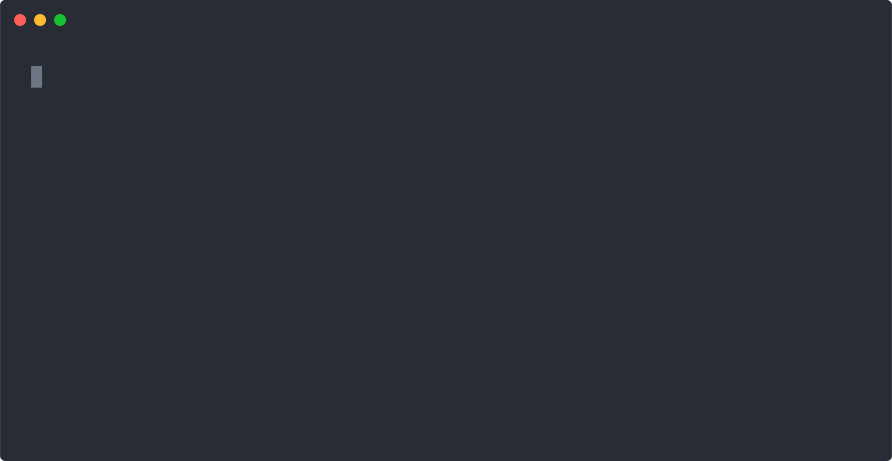
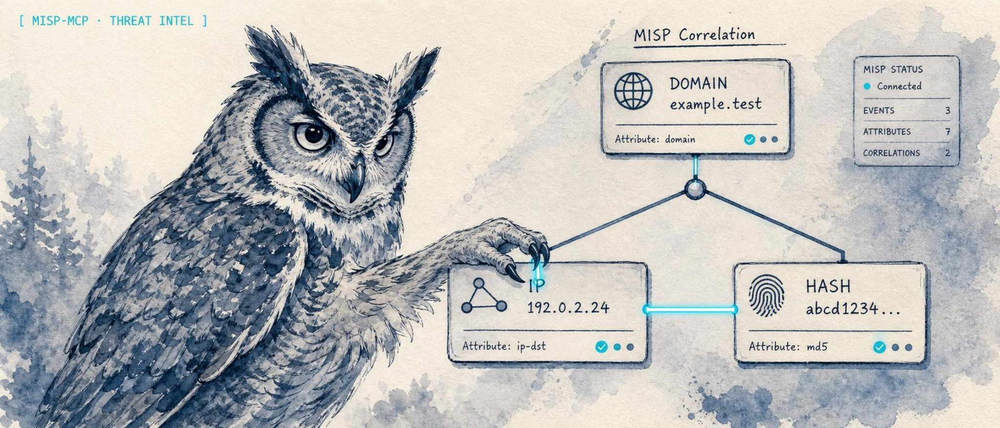
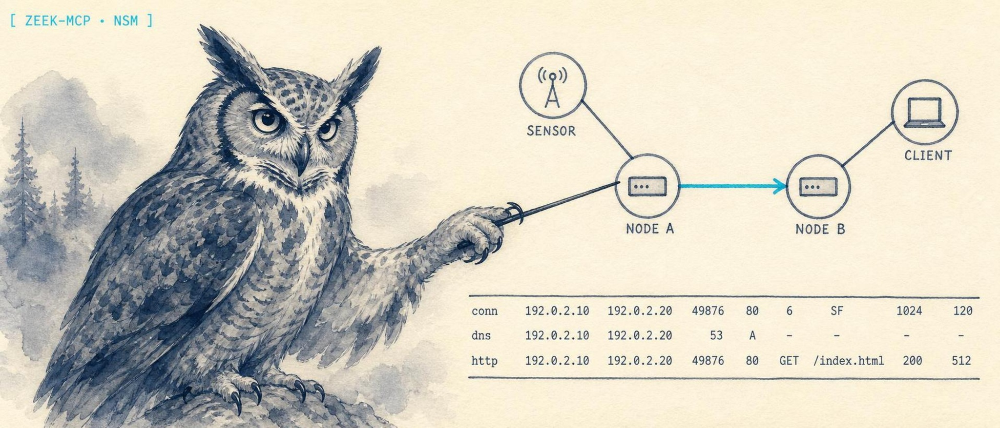

<p align="center">
  
</p>

<h1 align="center">lidless-fleet-kit</h1>

<p align="center">
  <strong>One shared dark-watch theme, one OG card, one watercolor banner pipeline, one SEO head, and routine tool-version sync for the <a href="https://lidless.dev">Lidless Labs</a> site fleet. Edit the kit once; the hub never drifts.</strong>
</p>

<p align="center">
  <a href="https://lidless.dev">lidless.dev</a> &middot; <a href="DESIGN.md">Design</a> &middot; <a href="ILLUSTRATION.md">Illustration</a> &middot; <a href="#banners">Banners</a> &middot; <a href="CONTRIBUTING.md">Contributing</a>
</p>

<p align="center">
  
  
  
  
</p>

The look is code. A great horned owl, a cyan accent, a cream-paper watercolor, one canonical OG card, and a SEO head every site inherits. Change it here, re-sync, done.

<p align="center">
  
</p>

<p align="center"><em><code>npm run banner</code> builds one tool's text-only image prompt; <code>npm test</code> guards the look contract.</em></p>

## What it does

You market one hub (`lidless.dev`) and the tools it watches over. Four things have to stay consistent and current, and a hand-driven session does all four badly:

- **One OG preview theme.** The link-preview card is rendered from a single dark-watch template (`og/template.html`) and a content map (`og/sites.json`): terminal-dark ground, one signal accent, the lidless-eye motif, the `LIDLESS` wordmark, the `The eye does not close.` motto. Change the theme once, regenerate.
- **One banner pipeline.** Every tool's README banner is built from one shared style (`banner/style.json`) plus a per-tool brief (`banner/briefs.json`) into a text-only image prompt: a great horned owl working one legible dashboard, cyan accent, cream watercolor. Frozen anchors and a test suite keep it from drifting. See [Banners](#banners).
- **One SEO head.** `seo/Seo.astro` + `seo/seo.ts` are the canonical `<head>` (title, description, canonical, Open Graph, Twitter, JSON-LD, theme-color), copied into the site and validated by `bin/seo-validate.mjs`.
- **One routine.** `bin/fleet-sync.sh` fast-forwards the checkout, syncs tool versions from GitHub releases, regenerates the card, syncs the SEO head, builds, validates, and commits and pushes only if something changed. Safe on a timer; a no-op run touches nothing.

The canonical design system is in [`DESIGN.md`](DESIGN.md); the image-style contract (og-card vs README banner, the owl + cyan watercolor) is in [`ILLUSTRATION.md`](ILLUSTRATION.md).

## How it differs

This is not a generic Astro starter or a logo pack. It is the source of truth for one fleet's *consistency*: the banner you see above was assembled from constants in `banner/style.json`, not hand-prompted, and `npm test` fails if the palette, the decorative-pattern exclusions, or the frozen anchor checksums drift. The art is AI-generated; the **look is version-controlled**.

## Install

```bash
git clone https://github.com/lidless-labs/lidless-fleet-kit.git
cd lidless-fleet-kit
npm install   # playwright-core (reuses an existing Chromium build); no other runtime deps
```

## Use

```bash
npm run og                  # regenerate the OG card from the shared theme
npm run banner -- wazuh-mcp # print the text-only image prompt for one tool's banner
npm test                    # check the banner look contract (palette, anchors, grammar)
npm run sync:dry            # preview tool-version changes, write nothing
npm run sync                # write the VERSIONS map into the site's src/lib/tools.ts
npm run fleet               # the full routine: pull + sync + render + seo + build + validate + push
```

`og/render.mjs` resolves a Chromium binary from the Playwright cache (falling back to system Chrome), so there is no web server in the loop (cron-safe).

## Banners

README banners are AI watercolors, but the *look* is code. Each one traces back to `banner/style.json` (the shared treatment) plus its `banner/briefs.json` entry (the owl + the specific dashboard), and every banner ships with the exact prompt in `banner/PROVENANCE.md`.

<p align="center">
  
  
</p>

The flow:

```bash
npm run banner -- mitre-mcp                    # print the prompt + write a provenance sidecar
# generate with GPT Image 2 (text-only); anchors-v1/ is a human style target, never a model input
python3 banner/crop-bands.py out/ render.png   # strip letterbox bands -> canonical 2048x878
node banner/insert-provenance.mjs mitre-mcp    # record the exact prompt in PROVENANCE.md
# drop the banner into the tool's repo and commit there
```

`npm test` enforces the contract: the palette tokens, the decorative-pattern exclusions, the frozen anchor checksums, every brief's shape, and the prompt grammar. The owl and the cyan accent are constant; the dashboard is the variable. Full intent is in [`ILLUSTRATION.md`](ILLUSTRATION.md).

## Version sources

`sites.config.json` maps each tool slug to its GitHub repo and a version source:

- `gh-release` reads the latest release tag (the `v` prefix is stripped).
- `manual` is never auto-touched (for a tool with no release yet).

To add a tool: add it to `sites.config.json` under `tools`, then `npm run sync`.

## Routine automation

`bin/fleet-sync.sh` is meant to run unattended (cron or an OpenClaw scheduled job). It pushes only on a real change and prints a short summary suitable for relaying to a chat channel. The site deploys on Vercel from `git push`, so a push from this kit is a deploy. Lidless is a **single hub repo**, not a fleet of per-tool subdomains; the kit is modelled on `escoffier-fleet-kit` but manages one checkout.

## Layout

```
DESIGN.md            dark-watch identity (tokens, type, the eye)
ILLUSTRATION.md      image style: og-card vs README banner, owl + cyan watercolor
sites.config.json    the hub + its tools (repo + version source)
og/                  OG card template, copy, and headless renderer (2400x1260)
banner/              the watercolor banner pipeline (style + briefs + prompt builder + tests)
seo/                 the shared <head>, JSON-LD builders, robots template, the SEO contract
bin/                 sync-versions, seo-validate, fleet-sync (the headless routine)
docs/assets/         the proof recording + sample banners
```

## Project

- [Contributing](CONTRIBUTING.md) - what lands easily, local dev, adding a banner or a tool
- [Code of Conduct](CODE_OF_CONDUCT.md) &middot; [Security policy](SECURITY.md) &middot; [Governance](GOVERNANCE.md) &middot; [Maintainers](MAINTAINERS.md)
- [Roadmap](ROADMAP.md) &middot; [Changelog](CHANGELOG.md)
- MIT licensed. Maintained by [@solomonneas](https://github.com/solomonneas) under the Lidless Labs organization.
